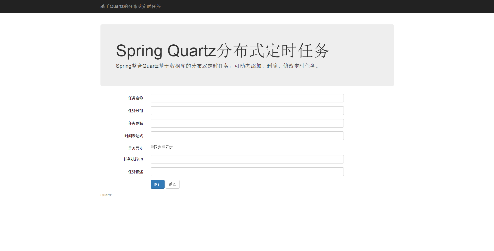
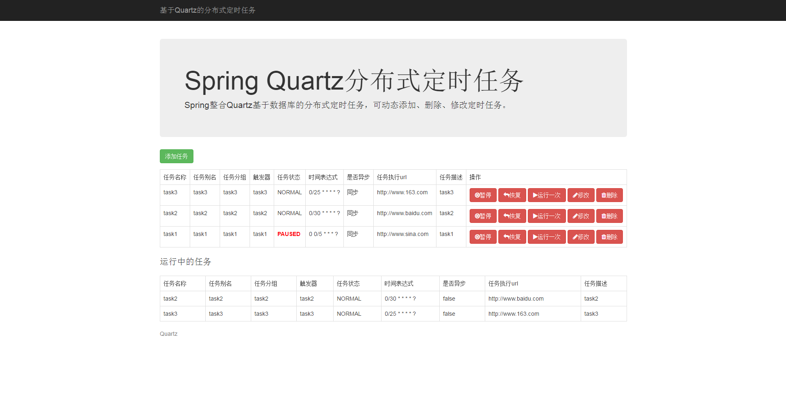

# spring-quartz-cluster-sample

Spring整合Quartz基于数据库的分布式定时任务，可动态添加、删除、修改定时任务。

**不建议在生产环境使用，生产环境强烈建议使用[xxl-job](https://github.com/xuxueli/xxl-job)**

操作步骤:

1、创建quartz数据库

2、执行src/main/resources/scripts下的建表语句

3、执行src/main/resources/create-schema.sql语句

4、修改数据库连接信息

# Screenshots

